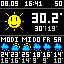

# pixoo-weather

A python script that gets the weather information from an api and displays it on the pixoo 64.
The script will call the rest api from the <a href="https://github.com/ankit-kapur/pixoo-rest">pixoo-rest</a> project to
send the created gif.

The script will generate a new gif every minute (to keep the time almost up-to-"time") and will fetch the newest weather
data every five minutes.

Currently you need to start pixoo-rest by yourself.

## How it looks like atm



## How to start

1. Pull repo
2. Install dependencies

```bash
pip install -r requirements.txt
```

3. Update .env with your data
4. run python script

```bash
python app.py
```

## My Ideas

1. Add more faces/icons for current weather
2. Add current temp from sensor outside
3. Update weather codes from api (cause I still don't know whats correct)
4. Start pixoo-rest server automatically
5. Do something against the blinking when gif is being uploaded (get rid of loading screen)
