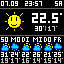

# pixoo-weather
A python script that gets the weather information from an api and displays it on the pixoo 64

## How it looks like atm



## How to start

1. Pull repo
2. Install dependencies
```bash
pip install -r requirements.txt
```
3. Update .env with your data
4. run python script app.py

If you did everything right you should see the weather information for the next 7 days in the console and soon after on your pixoo

## My Ideas
1. Add more faces/icons for current weather
2. Add current temp from sensor outside
3. Update weather codes from api (cause I still don't know whats correct)
